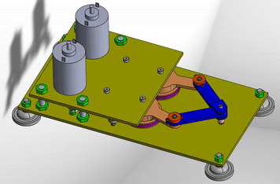

<!-- Improved compatibility of back to top link: See: https://github.com/othneildrew/Best-README-Template/pull/73 -->

<!-- PROJECT LOGO -->
 

  

  <h1 align="center">CAD Design of an Haptic Feedback Pantograph</h1>

  

    <a href="https://github.com/Habeeb-Yusuff?tab=repositories"><strong>View all repositories  »</strong></a>
     
     
  

<!-- TABLE OF CONTENTS -->

  
Table of Contents

  <ol>
    <li>
      <a href="#about-the-project">About The Project</a>
      <ul>
        <li><a href="#built-with">Built With</a></li>
      </ul>
    </li>
    <li>
      <a href="#getting-started">Getting Started</a>
      <ul>
        <li><a href="#prerequisites">Prerequisites</a></li>
<!--         <li><a href="#installation">Installation</a></li> -->
      </ul>
    </li>
    <li><a href="#usage">Usage</a></li>
<!--     <li><a href="#roadmap">Roadmap</a></li>
    <li><a href="#contributing">Contributing</a></li>
    <li><a href="#license">License</a></li> -->
    <li><a href="#contact">Contact</a></li>
<!--     <li><a href="#acknowledgments">Acknowledgments</a></li> -->
  </ol>

<!-- ABOUT THE PROJECT -->
## About The Project

This project aimed to develop a CAD model for an  Haptic Feedback Pantograph.   **Haptic feedback** refers to the use of tactile sensations, typically through vibrations or forces, to simulate the sense of touch in electronic devices or virtual environments, this is an invaluable tool in medical training, particularly in surgical simulations. Simulators equipped with haptic interfaces allow medical professionals to practice procedures in a virtual environment, feeling the resistance and forces as they would in a real surgery. Also, In robot-assisted surgery, haptic feedback enables surgeons to feel the tissues they are operating on through robotic instruments. This tactile feedback enhances precision and control, crucial in minimally invasive procedures.    A pantograph was used in this project to transmit forces or movements from one location to another, enabling a user to interact with a virtual or remote environment.

Keywords: Haptic Technology, Pantograph Robot Model, Virtual Environments.

[(Project Presentation)](https://github.com/Habeeb-Yusuff/Pantographs_for_haptic_feedback/blob/main/Haptic%20Project's%20Final%20Presentation%20(110523).pdf)

## CAD Assembly

    

## Global views

  

### Built With
* 

(<a href="#readme-top">back to top</a>)

<!-- GETTING STARTED -->
## Getting Started

All CAD files were designed in solid works 2022 version and can be opened with the same version and newer versions

### Prerequisites

Solidworks package

## The Project files

<!-- USAGE EXAMPLES -->
## Usage

1 - Unzip the file in 

2 - Open the 

3 - Run 

(<a href="#readme-top">back to top</a>)

<!-- CONTACT -->
## Contact

Habeeb Yusuff - [Linkedin - habeeb-yusuff](https://linkedin.com/in/habeeb-yusuff-347736176/) - Yusuffdayohabeeb@gmail.com

(<a href="#readme-top">back to top</a>)

